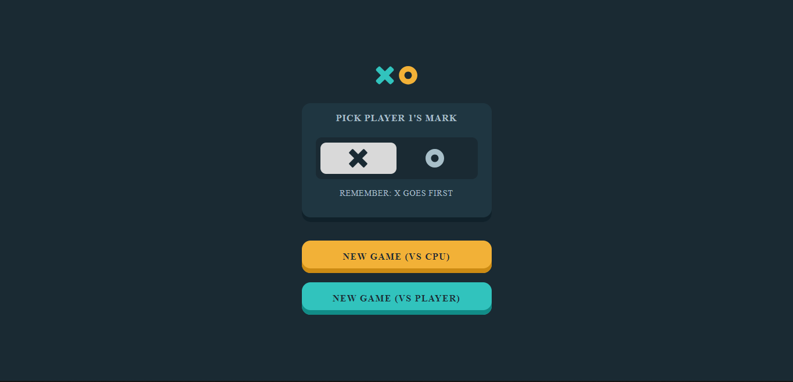

# Frontend Mentor - Tic Tac Toe solution

This is a solution to the [Tic Tac Toe challenge on Frontend Mentor](https://www.frontendmentor.io/challenges/tic-tac-toe-game-Re7ZF_E2v). Frontend Mentor challenges help you improve your coding skills by building realistic projects. 

## Table of contents

- [Overview](#overview)
  - [The challenge](#the-challenge)
  - [Screenshot](#screenshot)
  - [Links](#links)
  - [Built with](#built-with)
  - [What I learned](#what-i-learned)
  - [Continued development](#continued-development)
  - [Useful resources](#useful-resources)

**Note: Delete this note and update the table of contents based on what sections you keep.**

## Overview

### The challenge

Users should be able to:

- View the optimal layout for the game depending on their device's screen size
- See hover states for all interactive elements on the page
- Play the game either solo vs the computer or multiplayer against another person
- **Bonus 1**: Save the game state in the browser so that it’s preserved if the player refreshes their browser
- **Bonus 2**: Instead of having the computer randomly make their moves, try making it clever so it’s proactive in blocking your moves and trying to win

### Screenshot

### Links

- Solution URL: https://github.com/jaecoder20/tic-tac-toe.git
- Live Site URL: https://jaecoder20.github.io/tic-tac-toe/

### Built with

- Semantic HTML5 markup
- CSS custom properties
- Flexbox
- CSS Grid
- Mobile-first workflow
- Vanilla JS

### What I learned

- Elements are clickable only when their z-index > 0. This may seem simple but it cause a bug in my code that took an hour to figure out. The event listeners were attached but the elements just refused to respond to my clicks. Turns out I was not actually "clicking" them, since they were at z index -1.
- I learnt how to integrate the min-max algorithm 

### Continued development

- The alternating of players between rounds does not work very well. Sometimes it breaks, sometimes it does not. I am not sure why, but this is an issue I will solve in the future
- I would like to add some sort of visual buffer when it is the CPU's turn to play. For example, dynamically adding text that says "CPU is thinking..." or demonstrate how the algorithm is visiting each cell by using the outline svgs to "light up" the visited cells.

### Useful resources

- [YOUTUBE](https://www.youtube.com/watch?v=trKjYdBASyQ&t=721s) - This helped me with understanding and implementing the minimax algorithm.

